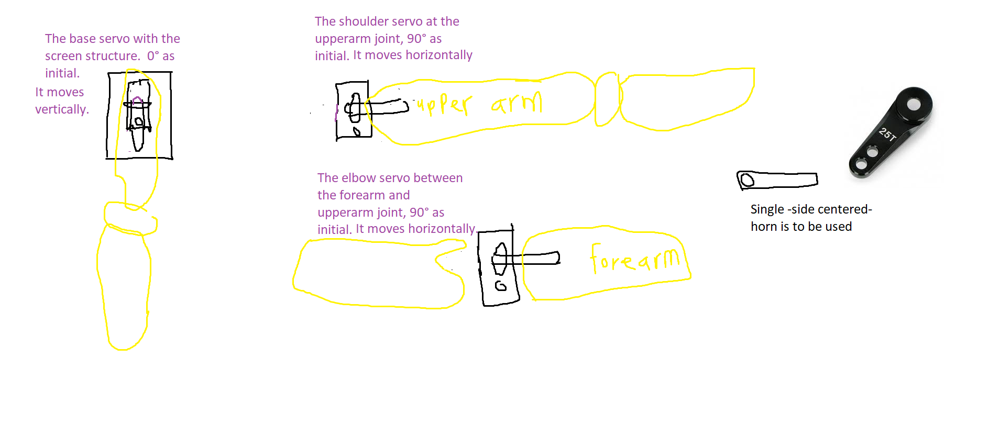

# Controling-robot-s-using-ultrasonic-sensor-and-bluetooth    


# Task 1 
An Arduino circuit controlling 6 Servo-motor with three synchronized motions  
  
  It is the first circuit and to be placed in the arm. The movements can be controlled using the switches or the Bluetooth signal. It should actually have a bluetooth module 
  that reveives the signals fom the sensor.
  
   **A. The code**  

```ruby
#include <Servo.h>
Servo s1;  //The Right elbow
Servo s2; //The  right soulder
Servo s3; //the right base of the arm
Servo s4; //The left elbow
Servo s5; //the left shoulder
Servo s6; //The left base


void setup()
{
  pinMode(13,INPUT);
  pinMode(6,INPUT);
  
  s1.attach(2);
  s2.attach(1);
  s3.attach(0);
  s4.attach(10);
  s5.attach(11);
  s6.attach(12);
}
    

void loop ()
{ 
  if (digitalRead(13)==1)
   // first move, when switch 1 is on 
   // The robot will rise the hand up
  {  s1.write(135);
     s2.write(45);
     s3.write(150);
     s4.write(45);
     s5.write(135);
     s6.write(150);
  }
   else if (digitalRead(6)==1)
    // Second move, when switch 2 is on 
   // The robot will advance hand in from of the screen 
   {  s1.write(93);
      s2.write(93);
      s3.write(93);
      s4.write(93);
      s5.write(93);
      s6.write(93);
   
   }
  
  else 
    /* This puts the arm in the initial position, with the arm
    pointing downward
    When both switch 1,2 are off*/
  {  s1.write(93);
     s2.write(93);
     s3.write(0);
     s4.write(93);
     s5.write(93);
     s6.write(0);
  
  
  }

     


}

  ```  
  
 **B. The circuit**  
   
   
 
 
 .png)
 
  **C. The simulation design**  
  
   [Click here to show the project in TinkerCad](https://www.tinkercad.com/things/7b1zyPrEuXJ)     
     
       
       
       
       
       
     
# Task 2.
An Arduino circuit controlling Ultrasonic sensor along with LCD.   
  
  
This circuits connects the sensor to the screen and the arm via Bluetooth. It will send a signal when a person is closer than 50 cm to the screen for 3 seconds. Since there is 
no  hardware nor bluetooth module in Tinkercad, I had to seperates the circuits. Here the LED will be on when there is a person satisfying our condition.    
For the LCD pins, we connected w/R pin to zero since write=0, EN  (which allows writing) and regitser select to the arduino. d0 to d7 tranfers data to the screen registers.  
Led+ and LED- are responsible to enlight the screen.  We must the formal connection (12 rigister select, 11 write en, 5 data, 4 data, 3 data, 2 data) since that allow us to use
the liberary functions. We connect the contrast pin to the wiper terminal in the potentiameter to control the brightness of the screen.


  We can use "ping" ultrasonic sensor, it sends a signals and  waits for its comeback. This is done by the function readultrasonicditance (defined at the end of the code). 
  It returns the trip duration microseconds. 
    

 The PING))) is triggered by a HIGH pulse of 2 or more  microseconds. This trigger that makes it sends its ultrasonic wave. We will make a short pulse beforehand to ensure a 
 clean HIGH pulse. The same pin is used to read the signal from the PING))): The PING generates a HIGH pulse hose duration is the time (in microseconds) from the sending of the 
 ping to the recption of its echo off of an object. That is, as soon as it sends a signal it gives one and waits until it has echo to lower the signal to zero. PulseIn counts 
 the period of this pulse.
 The "PulseIn" function in Arduino: Reads a pulse (either HIGH or LOW ) on a pin. For example, if value is HIGH , pulseIn() waits for the pin to go from LOW to HIGH , starts 
 timing, then waits for the pin to go LOW and stops timing. So i returns the period


 **A. The code**  

```ruby
// C++ code
//
// include the library code:
#include <LiquidCrystal.h>
int cm=0; 
int pinSensor=7;
int time ;
// initialize the library with the numbers of the interface pins
LiquidCrystal lcd(12, 11, 5, 4, 3, 2);

void setup() {
  // set up the LCD's number of columns and rows:
  lcd.begin(16, 2);
  // Print a message to the LCD.
  lcd.print("Start!");
  pinMode(pinSensor,INPUT);
  pinMode(6,OUTPUT);
  delay(2000);
 
}

void loop() {
  lcd.clear();    // We have 0.01723 becasue distance= T* (speed of sound)/2, but T in microseonds.
  cm=0.01723*readUltrasonicDistance(pinSensor);
  lcd.setCursor(0,0);
  lcd.print("Distance in CM: ");
  lcd.setCursor(0,1); //column,line
  lcd.print(cm);
  
  if (cm>50)
  {time=millis();                 //This gives the variavle "time" the first value of millis() when the command was executed. 
   digitalWrite(6,LOW);}          //millis() Returns the number of milliseconds since Arduino board began running the current program
  else if (cm<50)
      {                           //This block of if statements will turn the LED on when there an object near 50 cm for more than 3 seconds
    if (millis() - time >= 3000)     // If we had HC-05, then its code should be here
        digitalWrite(6,HIGH);
        
  }
    
    
    
    
  
  delay(1000);
  

}


long readUltrasonicDistance(int pinSensor)
{
  pinMode(pinSensor, OUTPUT);
  digitalWrite(pinSensor,LOW);
  delayMicroseconds(2);
  digitalWrite(pinSensor, HIGH);
  delayMicroseconds(10);
  digitalWrite(pinSensor, LOW);
  pinMode(pinSensor, INPUT);
  return pulseIn(pinSensor, HIGH);
}
  ```  
  
 **B. The circuit**  
   
   
 
 .png)
 
  **C. The simulation design**  
  
   [Click here to show the project in TinkerCad](https://www.tinkercad.com/things/1JW0aNTC8uV)   
     
            
                 
     
       
       
       
     
       
         

  # Task 3. 
  The Bluetooth module  
  
  There should be two bluetooth module (HC-05), one with arduino circuit of the sensor that works as a transmitter while the other at the arduino circuit of the arm's servos
  that works as a receiver. The transmitter's code should be placed in the if bolck for the LED in task 2. On the other hand, the receiver's code should be placed in task's 1 
  code such that when it gets the signal it sends it to the switches to allow a desired movement.  
  
  
  
   **A. The transmitter's code** 
   ```
   #include<SoftwareSerial.h>
	SoftwareSerial myserial(0,1);
	int x = 12;  
	void setup() {
	 myserial.begin(9600);
 //serial.begin(9600);  This shows the data tranfer at the moment between the arduino and computer (data in the USB) 
	 pinMode(x, INPUT); // Instead of the LED, or (much easier) directly in the code, inside the if. 
	}
	

	void loop() {
	 if (x==HIGH)
	 { myserial.write("1") }
	    else {
	  myserial.write("1")
	      }

	}

   ```
   
   **B. The receiver's code** 
   ```
   #include<SoftwareSerial.h>
	SoftwareSerial myserial(0,1);
	int x = 12;   // Arduino pin that gives HIGH when this module receives information to move
	void setup() {
	 myserial.begin(9600);
	 pinMode(x, OUTPUT); 
	
	}
	

	void loop() {
	 if (myserial.available())
	 {
	
	  if (myserial.read() == "1")
	  {
	    digitalWrite(x , HIGH);
	    }
	    else {
	      digitalWrite(x , LOW) ; 
	      }
	  }
	

	}


   ```
